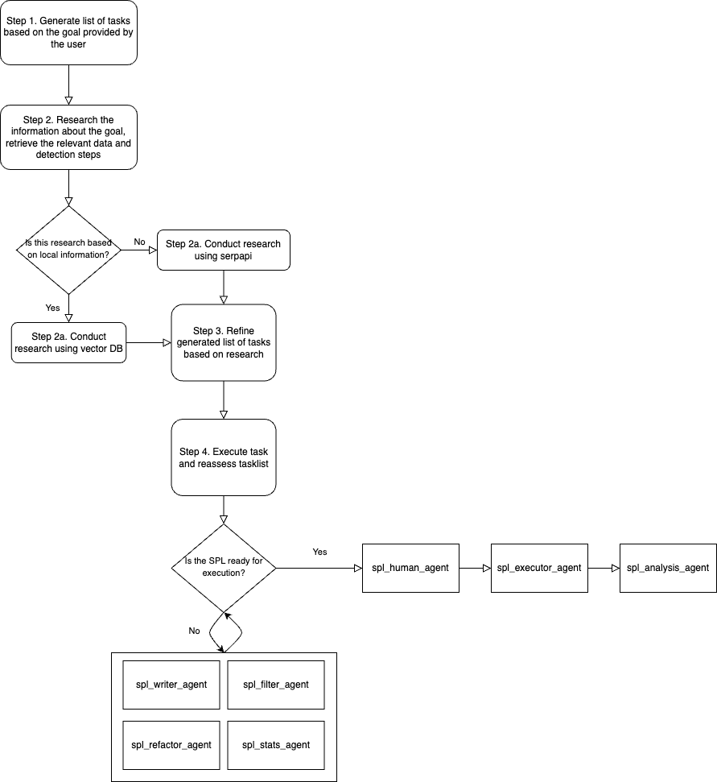

# SplunkGPT
SplunkGPT is an LLM task based agent that converts natural language queries into Search Processing Language queries, runs the query, and provides a summary based on the results recieved. The agent is designed with the goal of detecting malicious activity by either searching a local vector database or by using serpapi to research the indicators of compromise. 

## How it works
The agent begins by prompting the user for a goal. The goal is then broken down into a list of tasks. The agent then researches what data could be used to detect the goal in mind either locally using a vector database or remotely using serpapi. The data is then used to refine the list of tasks and begin executing the agent actions to write, refactor, and apply a statistical threshold to detect the goal in mind. The agent wraps up its tasks by prompting the user if the query needs to be refined and then executes the query on the splunk server once the user is content with the query that has been generated. The results of the query are then summarized and the user is presented with remediation and mitigation steps.   

 

## Repo Breakdown
This repo is broken down into three folders: Applicatoin, Notebook, and Presentation. To run the streamlit application, jupyter notebook, or cookbook a user should have an OPENAI, serpapi, and langchain api key. Access to query a splunk server remotely using the Splunk SDK will also be required.  

### Application
The Application folder is a streamlit application that was designed as a way to visually demonstrate the agent in action. To run the streamlit application, download and install the requirements listed and run with `streamlit run app.py`

### Notebook
The Notebook folder is the original proof of concept agent that was engineered in a Jupyter notebook. To run the notebook, install jupyter notebook, run `jupyter notebook` and then run each cell one by one. 

### Presentation
The Presentation folder contains the slides, demo video, and cookbook that was presented during BsidesAugusta 2023. The cookbook is designed to provide a brief introduction into the concepts used to build this agent. Once the bsides video is released, this repo will be updated with a link to the video. 

# References
This project could not have been possible without the work done by:
- [Greg Kamradt (Data Indy)](https://www.youtube.com/channel/UCyR2Ct3pDOeZSRyZH5hPO-Q) 
- [BabyAGI](https://github.com/yoheinakajima/babyagi)
- [AgentGPT](https://github.com/reworkd/AgentGPT)
- [SplunkAI](https://splunkbase.splunk.com/app/6410)
- [OpenAI Documentation](https://splunkbase.splunk.com/app/6410)
- [LangChain Documentation](https://docs.langchain.com/docs/)

